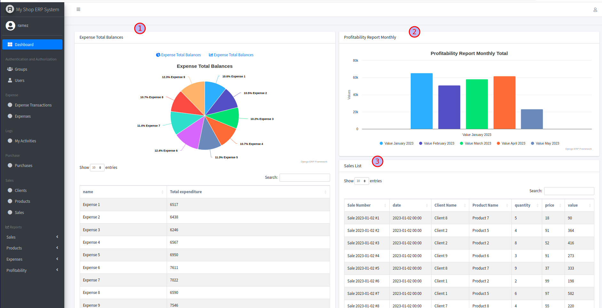

Walkthrough
=============

Log in to "My Shop", our demo site  https://my-shop.django-erp-framework.com/  with the following credentials:

Username `test`

Password `testuser123`

This is a custom admin site with a dashboard and reporting. :ref:`erp_admin`

The demo site contains 3 dashboards:

1. The default dashboard, with jazzmin theme (https://my-shop.django-erp-framework.com/)
   The dashboard is for a sample ERP site, with a few widgets and reports.

2. A custom dashboard with a custom index template (https://my-shop.django-erp-framework.com/requests-dashboard/)
   This dashboard is for the requests app https://github.com/django-request/django-request
   It's using a custom base template, like what you'd need to integrate this project into your own site.

3. A custom dashboard created without the erp admin site.
   A demo of how to use the framework in your own views and templates.

In the default dashboard You see reports displayed as widgets:

#. Expense total
#. Profitability Monthly (A time series report)
#. Sales list
#. Product Movement Statement (debit and credit transactions)
#. A custom success call back to display the ajax json response of the report
#. Product Client Sales Comparision (A cross tab report)

*Links*

* How to add a widget :ref:`widgets`
* Check the demo index template on github https://github.com/ra-systems/my-shop/blob/main/templates/admin/custom_index.html
* Create a Time Series <link here>

Apps
----
My Shop default dashboard is composed of 3 apps to demo django erp framework
Expense, Sales & Purchase

#. Expense:
   is a simple django app with a model Expense and a model ExpenseTransaction. Registered in regular ModelAdmin.

#. Sales: In Sales app we use bundled base model and ModelAdmin

#. Purchase: In Purchase app we can see how to create & customize reports calculations.

Reports
-------
You can find the reports section in the left hand side menu. The reports are grouped by base model. You can create your own reports and calculations. The reports are displayed as tables and charts. You can also export the reports to csv and excel.
Check :ref:`reporting` for more details.

Front end integration
---------------------

You can use the framework in your own views and templates, and not just in the admin site.
Find the "Front End Dashboard" link in the left hand side menu. This is a simple dashboard with a few charts and tables.
You can use this as a starting point for your own dashboard. Code on github: https://github.com/RamezIssac/my-shop/blob/main/templates/front_end_dashboard.html

